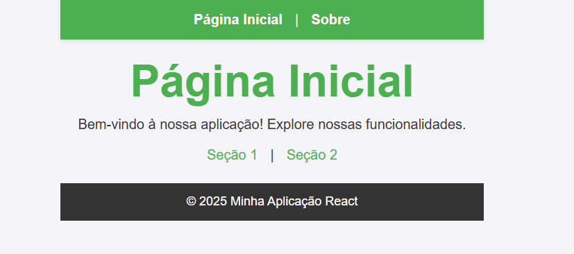
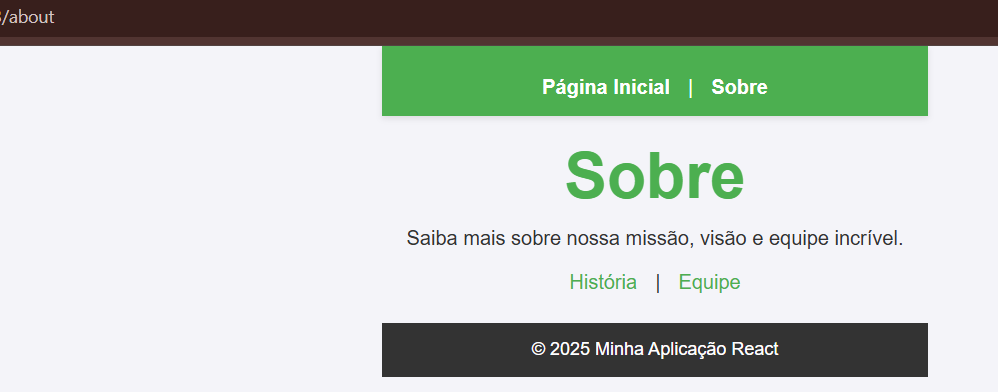
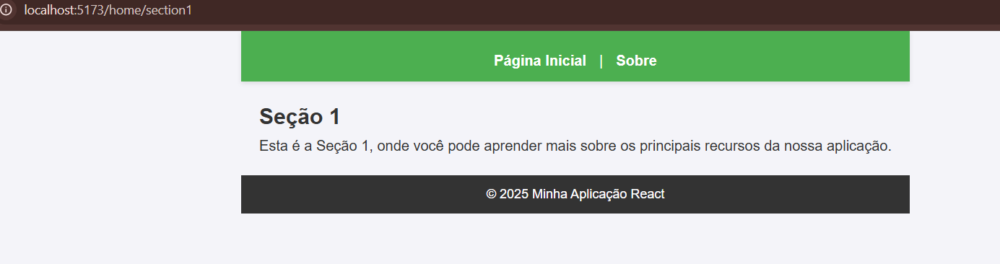
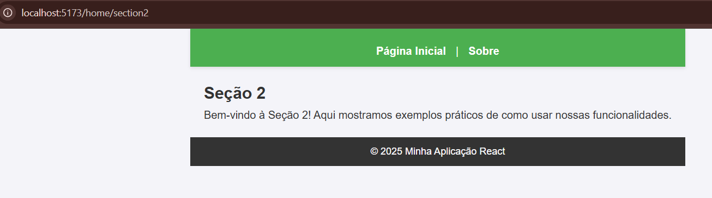
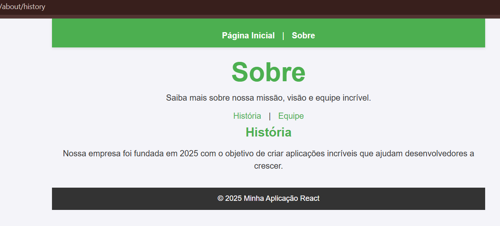
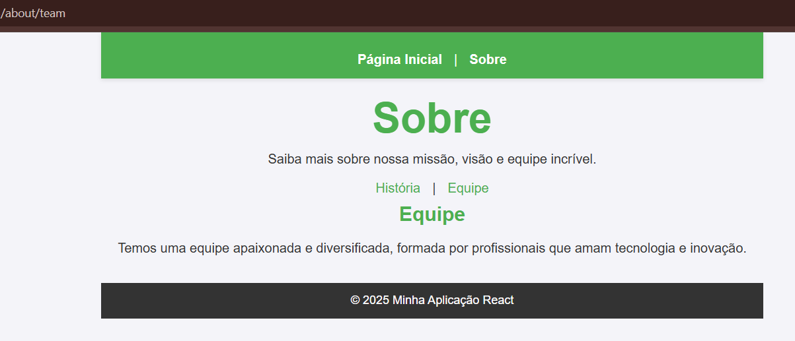

# Atividade: Configuração de Rotas com React Router

Este projeto é uma aplicação React criada para demonstrar o uso básico do React Router. Ele inclui a configuração de rotas principais e sub-rotas, juntamente com estilos consistentes para manter um layout uniforme em toda a aplicação.

## Funcionalidades

1. **Rotas Principais**:

   - **Página Inicial** ("/"): Exibe um título e uma descrição introdutória da aplicação.
   - **Página Sobre** ("/about"): Apresenta informações sobre a aplicação e links para sub-rotas.

2. **Sub-rotas**:

   - Na **Página Inicial**:
     - **Seção 1** ("/home/section1"): Detalha os principais recursos da aplicação.
     - **Seção 2** ("/home/section2"): Apresenta exemplos práticos de uso das funcionalidades.
   - Na **Página Sobre**:
     - **História** ("/about/history"): Conta a história da aplicação.
     - **Equipe** ("/about/team"): Apresenta a equipe responsável pelo desenvolvimento.

3. **Estilo Consistente**:
   - Um layout uniforme com cabeçalho, rodapé e conteúdo centralizado em todas as rotas.
   - Estilos definidos no arquivo `App.css`.

## Tecnologias Utilizadas

- **React**: Biblioteca JavaScript para criação de interfaces de usuário.
- **React Router Dom**: Biblioteca para gerenciamento de rotas em aplicações React.
- **Vite**: Ferramenta de desenvolvimento rápida para criação de projetos front-end.

## Componentes Criados

### App.jsx

- Configuração das rotas principais e sub-rotas utilizando `Routes` e `Route`.
- Links de navegação entre as páginas.

### Home.jsx

- Componente que exibe o conteúdo da página inicial.
- Inclui links para as sub-rotas "Seção 1" e "Seção 2".

### About.jsx

- Componente que exibe o conteúdo da página "Sobre".
- Inclui links para as sub-rotas "História" e "Equipe".

### Section1 e 2 e Section2.jsx

- Componentes das sub-rotas da página inicial, com textos exclusivos.

### History e Team

- Componentes das sub-rotas da página "Sobre", com conteúdos distintos.

